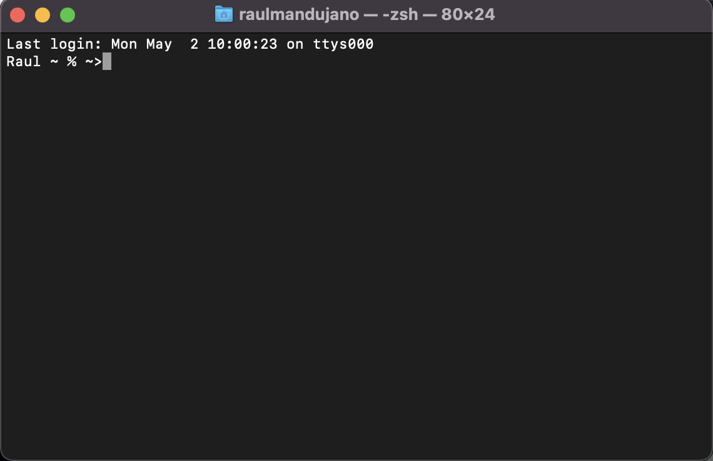

## What is the terminal? Why is it an important tool for a web developer?

#### Terminals are the commands inside the computer that allow us to complete tasks using specific commands for those actions. It is an important tool for a Web Developer as it allows you to complete and manage diferent projects remotely at the same tieme from a personal computer.

## For you, what are some important built-in commands to know. What do they do, and why are they important? (At least 5)

- cd : It allows you to access or return between folders. This important command as it allows you to navigate within terminals.
- touch :  It allows you to create files when you are navegating into terminals.
- code . : This one is a command. created to open Visual Studio. I use it a lot because when I am working on termianls I dont have to try to find the folder I am working on it. 
- git :  Git allows you to connect your project from a loca repo to an online repository and make the job easier when working with a team.
- mkdir :  This is used when. you. want to create a folder to start your project, and this way you never leave terminals to set up everything.

## What is the root?

####. Rooting are the roots create to have control in your code. It can be data and system.

## What is the path?

#### PATH are the intertwined routes of a directory where the executable codes are saved.

## What is the present working directory?

#### It is the directory where the user is programming and makes most of the changes through the command prompt. When you just set up where you are going to work, that would be a working directory.

## What is the bin? How does it work?

####. BIN files are the binary files.They are practically the files of 1 and 0s that are translated based on the programming language which is being programmed.

## Write about at least two new things you have personally learned about the command line.

#### I have learned that with the commands you can access complete libraries like React. And you can also run back-end servers through node.js

The functionality of using commands is priority to complete projects or be a web developer.
